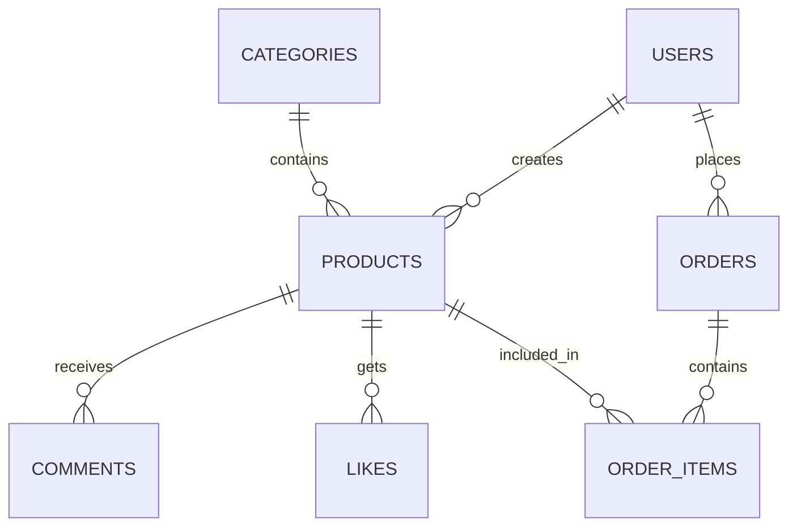

<div align="center">
  <h1>🛒 E-Commerce Platform</h1>
  <p><strong>Modern Multi-Tenant E-Commerce Solution</strong></p>
  
  <p>
    
    
    
    
  </p>
  
  <p>
    
    
    
  </p>
</div>

---

## 🌟 Overview

A **full-stack e-commerce platform** built with modern technologies, featuring multi-tenant support, real-time notifications, and comprehensive product management. Perfect for businesses looking to create their own marketplace.

### ✨ Key Highlights
- 🏪 **Multi-Tenant**: Support for multiple stores
- 🔐 **Role-Based Auth**: Admin, Tenant, User roles
- 📱 **Mobile-First**: Responsive design
- ⚡ **Real-Time**: Live notifications
- 🎨 **Modern UI**: Tailwind CSS + Framer Motion
- 📊 **Analytics**: Built-in reporting

---

## 🚀 Features

<table>
<tr>
<td width="50%">

### 🌐 Frontend (React + Vite)
- 🎨 **Modern UI/UX**: Responsive design with Tailwind CSS
- 🎬 **Smooth Animations**: Framer Motion integration
- 🔐 **Multi-Role Auth**: Admin, Tenant, User roles
- 🛍️ **Product Management**: Browse, search, filter
- 🛋 **Shopping Cart**: Add to cart, wishlist functionality
- 📦 **Order Management**: Place orders, track status
- 🔔 **Real-time Notifications**: Live updates
- 🏪 **Store Pages**: Individual tenant stores
- 📱 **WhatsApp Integration**: Order communication
- 📷 **Image Sharing**: Product sharing with screenshots

</td>
<td width="50%">

### ⚙️ Backend (Node.js + Express)
- 🔗 **RESTful API**: Comprehensive API endpoints
- 🏢 **Multi-tenant**: Separate dashboards
- 📎 **File Upload**: Multer integration
- 🗄 **Database**: MySQL with proper relationships
- 📊 **Analytics**: Sales analytics and reporting
- 🔔 **Notification System**: Real-time updates
- 🔒 **Security**: JWT tokens, password hashing
- 🛡️ **CORS Protection**: Cross-origin security
- 📝 **Logging**: Comprehensive error handling
- 🔄 **Auto-refresh**: Real-time data updates

</td>
</tr>
</table>

## 🛠️ Tech Stack

<div align="center">

### Frontend
| Technology | Version | Purpose |
|------------|---------|----------|
| ⚛️ React | 19.1.0 | UI Library |
| ⚡ Vite | 6.3.6 | Build Tool |
| 🎨 Tailwind CSS | 4.1.11 | Styling |
| 🎬 Framer Motion | 12.23.9 | Animations |
| 🗺️ React Router | 7.7.0 | Routing |
| 🔗 Axios | 1.13.2 | HTTP Client |
| 🎨 React Icons | 5.5.0 | Icons |
| 📊 Chart.js | 4.5.0 | Data Visualization |

### Backend
| Technology | Version | Purpose |
|------------|---------|----------|
| 🟢 Node.js | Latest | Runtime |
| 🚀 Express | 4.18.2 | Web Framework |
| 🗄 MySQL2 | 3.6.5 | Database Driver |
| 🔐 JWT | 9.0.2 | Authentication |
| 🔒 Bcrypt | 6.0.0 | Password Hashing |
| 📎 Multer | 1.4.5 | File Upload |
| 🌐 CORS | 2.8.5 | Cross-Origin |

</div>

## 📊 Database Schema

<div align="center">
  
</div>

### 🗄 Core Tables



| Table | Purpose | Key Features |
|-------|---------|-------------|
| 👥 **users** | Multi-role user management | Admin/Tenant/User roles |
| 🛍️ **products** | Product catalog | Categories, ratings, stock |
| 📋 **categories** | Product categorization | Hierarchical structure |
| 📦 **orders** | Order management | Status tracking, items |
| 💬 **comments** | Reviews and ratings | Product feedback system |
| ❤️ **likes** | Wishlist functionality | User preferences |
| 🔔 **notifications** | Real-time alerts | User interactions |
| 🎠 **carousel_items** | Homepage banners | Dynamic content |
| 📧 **contacts** | Contact form | Customer support |

### 🔗 Key Relationships
- 🛍️ Products belong to categories and users (tenants)
- 📦 Orders contain multiple order items
- 💬 Comments and likes are linked to products and users
- 🔔 Notifications are sent to tenants for user interactions

## 🚀 Quick Start

<div align="center">
  
</div>

### 📋 Prerequisites
```bash
✓ Node.js (v16+)
✓ MySQL/MariaDB
✓ npm or yarn
```

### 🛠️ Installation

<details>
<summary><strong>📁 1. Clone & Install</strong></summary>

```bash
# Clone repository
git clone <repository-url>
cd Ecommerce

# Install frontend dependencies
npm install

# Install backend dependencies
cd backend
npm install
```
</details>

<details>
<summary><strong>🗄️ 2. Database Setup</strong></summary>

```bash
# Create database
mysql -u root -p < database.sql

# Run migrations
npm run setup-db
npm run migrate-db
```
</details>

<details>
<summary><strong>⚙️ 3. Environment Configuration</strong></summary>

**Frontend (.env)**
```env
VITE_API_BASE_URL=http://localhost:5006/api
VITE_SERVER_URL=http://localhost:5006
```

**Backend (.env)**
```env
DB_HOST=localhost
DB_USER=root
DB_PASSWORD=your_password
DB_NAME=e-commerce
JWT_SECRET=your_jwt_secret
PORT=5006
```
</details>

<details>
<summary><strong>🚀 4. Start Development</strong></summary>

```bash
# Terminal 1: Start backend
cd backend
npm run dev

# Terminal 2: Start frontend
npm run dev
```

🎉 **Open http://localhost:5173 in your browser!**
</details>

## 📁 Project Structure

```
Ecommerce/
├── src/                          # Frontend source
│   ├── pages/                    # Page components
│   │   ├── Home.jsx             # Homepage with products
│   │   ├── ProductDetail.jsx    # Product details page
│   │   ├── Dashboard.jsx        # Admin dashboard
│   │   ├── TenantDashboard.jsx  # Tenant dashboard
│   │   └── ...
│   ├── components/              # Reusable components
│   ├── assets/components/       # UI components
│   ├── context/                 # React context providers
│   ├── services/                # API services
│   └── utils/                   # Utility functions
├── backend/
│   ├── src/
│   │   ├── controllers/         # Route controllers
│   │   ├── models/             # Database models
│   │   ├── routes/             # API routes
│   │   ├── middleware/         # Custom middleware
│   │   └── config/             # Configuration files
│   └── public/uploads/         # File uploads
└── database-diagram.dbml        # Database schema diagram
```

## 🔐 Authentication & Authorization

### User Roles
- **Admin**: Full system access, user management, analytics
- **Tenant**: Product management, order handling, store analytics
- **User**: Browse products, place orders, manage wishlist

### Protected Routes
- Role-based route protection
- JWT token validation
- Automatic token refresh
- Secure password hashing

## 🎨 UI/UX Features

### Design System
- Consistent red/white color scheme
- Mobile-first responsive design
- Smooth animations and transitions
- Loading states and error handling
- Toast notifications

### User Experience
- Intuitive navigation with breadcrumbs
- Search and filter functionality
- Infinite scroll pagination
- Image optimization and lazy loading
- Offline-friendly with local storage

## 📈 Analytics & Reporting

<table>
<tr>
<td width="50%">

### 👑 Admin Analytics
- 👥 Total users, products, orders
- 💰 Revenue tracking
- 📈 User activity monitoring
- 🔍 System health metrics

</td>
<td width="50%">

### 🏪 Tenant Analytics
- 🛍️ Product performance
- 📊 Sales statistics
- 👤 Customer interactions
- 📉 Revenue reports

</td>
</tr>
</table>

---

## 🔗 API Endpoints

<details>
<summary><strong>🔐 Authentication</strong></summary>

| Method | Endpoint | Description |
|--------|----------|-------------|
| POST | `/api/auth/login` | User login |
| POST | `/api/auth/register` | User registration |
| GET | `/api/auth/profile` | Get user profile |

</details>

<details>
<summary><strong>🛍️ Products</strong></summary>

| Method | Endpoint | Description |
|--------|----------|-------------|
| GET | `/api/products` | List all products |
| GET | `/api/products/:id` | Get product details |
| POST | `/api/products` | Create product (tenant) |
| PUT | `/api/products/:id` | Update product (tenant) |

</details>

<details>
<summary><strong>📦 Orders</strong></summary>

| Method | Endpoint | Description |
|--------|----------|-------------|
| POST | `/api/orders` | Create order |
| GET | `/api/orders` | Get user orders |
| PUT | `/api/orders/:id` | Update order status |

</details>

<details>
<summary><strong>🔔 Notifications</strong></summary>

| Method | Endpoint | Description |
|--------|----------|-------------|
| GET | `/api/notifications` | Get notifications |
| PUT | `/api/notifications/:id/read` | Mark as read |

</details>

---

<div align="center">
  <h2>🚀 Ready to Deploy?</h2>
  
  <table>
  <tr>
  <td align="center" width="33%">
    <h3>🌐 Frontend</h3>
    <code>npm run build</code><br>
    Deploy to Vercel/Netlify
  </td>
  <td align="center" width="33%">
    <h3>⚙️ Backend</h3>
    <code>npm start</code><br>
    Deploy to Railway/Heroku
  </td>
  <td align="center" width="33%">
    <h3>🗄️ Database</h3>
    <code>npm run migrate-db</code><br>
    MySQL/PostgreSQL
  </td>
  </tr>
  </table>
</div>

---

## 🐛 Known Issues & 🔮 Future Plans

<table>
<tr>
<td width="50%">

### 🐛 Current Issues
- ⭐ Rating system requires manual refresh
- 🖼️ Image uploads limited to specific formats
- 📱 WhatsApp integration needs manual setup

</td>
<td width="50%">

### 🔮 Coming Soon
- 💬 Real-time chat system
- 💳 Advanced payment gateway
- 📱 Mobile app development
- 🤖 AI-powered recommendations
- 🌍 Multi-language support

</td>
</tr>
</table>

---

<div align="center">
  <h2>📞 Need Help?</h2>
  
  <p>
    <a href="#"></a>
    <a href="mailto:info@ecommerce.com"></a>
    <a href="#"></a>
  </p>
  
  <h3>🚀 Built with ❤️ using React, Node.js, and MySQL</h3>
  
  <p>
    
    
  </p>
</div>