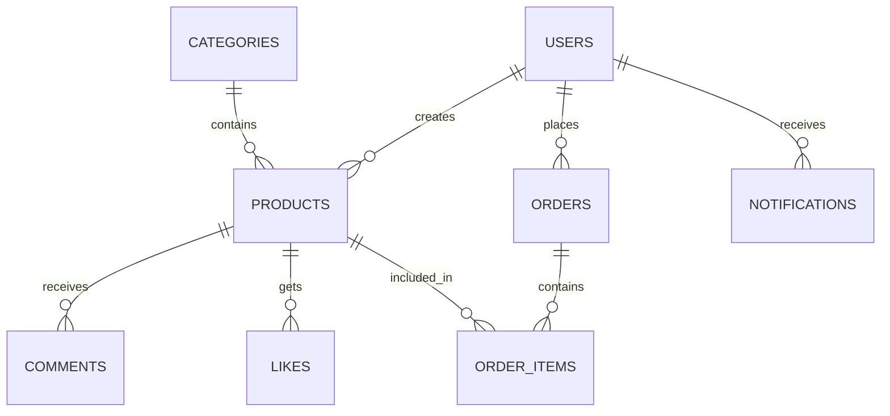

<div align="center">
  
  <!-- Animated Header -->
  
  
  <br><br>
  
  <!-- Animated Badges -->
  <p>
    
    
    
    
  </p>
  
  <!-- Status Badges -->
  <p>
    
    
    
    
  </p>
  
  <!-- Animated Divider -->
  
  
</div>

## 🌟 Overview

<div align="center">
  
</div>

<br>

A **modern, full-stack e-commerce platform** built with cutting-edge technologies, featuring multi-tenant support, real-time notifications, and comprehensive product management. Designed for scalability and performance.

### ✨ Key Highlights

<table>
<tr>
<td align="center" width="20%">
  <br>
  <strong>🏪 Multi-Tenant</strong><br>
  <sub>Multiple stores support</sub>
</td>
<td align="center" width="20%">
  <br>
  <strong>🔐 Role-Based Auth</strong><br>
  <sub>Admin, Tenant, User roles</sub>
</td>
<td align="center" width="20%">
  <br>
  <strong>📱 Mobile-First</strong><br>
  <sub>Responsive design</sub>
</td>
<td align="center" width="20%">
  <br>
  <strong>⚡ Real-Time</strong><br>
  <sub>Live notifications</sub>
</td>
<td align="center" width="20%">
  <br>
  <strong>📊 Analytics</strong><br>
  <sub>Built-in reporting</sub>
</td>
</tr>
</table>

<div align="center">
  
</div>

## 🚀 Features

<details>
<summary><strong>🌐 Frontend Features (Click to expand)</strong></summary>

<br>

| Feature | Description | Status |
|---------|-------------|--------|
| 🎨 **Modern UI/UX** | Responsive design with Tailwind CSS | ✅ |
| 🎬 **Smooth Animations** | Framer Motion integration | ✅ |
| 🔐 **Multi-Role Auth** | Admin, Tenant, User roles | ✅ |
| 🛍️ **Product Management** | Browse, search, filter products | ✅ |
| 🛋 **Shopping Cart** | Add to cart, wishlist functionality | ✅ |
| 📦 **Order Management** | Place orders, track status | ✅ |
| 🔔 **Real-time Notifications** | Live updates | ✅ |
| 🏪 **Store Pages** | Individual tenant stores | ✅ |
| 📱 **WhatsApp Integration** | Order communication | ✅ |
| 📷 **Image Sharing** | Product sharing with screenshots | ✅ |

</details>

<details>
<summary><strong>⚙️ Backend Features (Click to expand)</strong></summary>

<br>

| Feature | Description | Status |
|---------|-------------|--------|
| 🔗 **RESTful API** | Comprehensive API endpoints | ✅ |
| 🏢 **Multi-tenant** | Separate dashboards | ✅ |
| 📎 **File Upload** | Multer integration | ✅ |
| 🗄 **Database** | MySQL with proper relationships | ✅ |
| 📊 **Analytics** | Sales analytics and reporting | ✅ |
| 🔔 **Notification System** | Real-time updates | ✅ |
| 🔒 **Security** | JWT tokens, password hashing | ✅ |
| 🛡️ **CORS Protection** | Cross-origin security | ✅ |
| 📝 **Logging** | Comprehensive error handling | ✅ |
| 🔄 **Auto-refresh** | Real-time data updates | ✅ |

</details>

<div align="center">
  
</div>

## 🛠️ Tech Stack

<div align="center">
  
  
  
</div>

<br>

<table>
<tr>
<td width="50%" valign="top">

### 🎨 Frontend Technologies

<div align="center">

| Technology | Version | Purpose |
|------------|---------|---------|
|  **React** | 19.1.0 | UI Library |
|  **Vite** | 6.3.6 | Build Tool |
|  **Tailwind CSS** | 4.1.11 | Styling |
|  **Framer Motion** | 12.23.9 | Animations |
|  **React Router** | 7.7.0 | Routing |
|  **Axios** | 1.13.2 | HTTP Client |
|  **React Icons** | 5.5.0 | Icons |
|  **Chart.js** | 4.5.0 | Data Visualization |

</div>

</td>
<td width="50%" valign="top">

### 🚀 Backend Technologies

<div align="center">

| Technology | Version | Purpose |
|------------|---------|---------|
|  **Node.js** | Latest | Runtime |
|  **Express** | 4.18.2 | Web Framework |
|  **MySQL2** | 3.6.5 | Database Driver |
|  **JWT** | 9.0.2 | Authentication |
|  **Bcrypt** | 6.0.0 | Password Hashing |
|  **Multer** | 1.4.5 | File Upload |
|  **CORS** | 2.8.5 | Cross-Origin |

</div>

</td>
</tr>
</table>

<div align="center">
  
</div>

## 📁 Project Structure

<div align="center">
  
</div>

<br>

```
🛒 Ecommerce/
├── 🎨 frontend/              # React.js Frontend Application
│   ├── 📁 src/              # Source code
│   │   ├── 📄 pages/        # Page components
│   │   ├── 🧩 components/   # Reusable components
│   │   ├── 🎨 assets/       # UI components & assets
│   │   ├── 🔄 context/      # React context providers
│   │   ├── 🔧 services/     # API services
│   │   └── 🛠️ utils/        # Utility functions
│   ├── 🌐 public/           # Static assets
│   ├── 📦 package.json      # Frontend dependencies
│   └── 📖 README.md         # Frontend documentation
├── 🚀 backend/              # Node.js Backend API
│   ├── 📁 src/             # API source code
│   │   ├── 🎮 controllers/ # Route handlers
│   │   ├── 📊 models/      # Database models
│   │   ├── 🛣️ routes/       # API routes
│   │   ├── 🔒 middleware/  # Custom middleware
│   │   └── ⚙️ config/      # Configuration files
│   ├── 📂 public/          # File uploads
│   ├── 📦 package.json     # Backend dependencies
│   └── 📖 README.md        # Backend documentation
├── 🗄️ database-diagram.dbml # Database schema diagram
└── 📋 README.md            # Main project documentation
```

<div align="center">
  
</div>

## 📊 Database Schema

<div align="center">
  
</div>

<br>

### 🗄 Core Tables Overview

<div align="center">



</div>

<details>
<summary><strong>📋 Database Tables (Click to expand)</strong></summary>

<br>

| Table | Purpose | Key Features | Records |
|-------|---------|-------------|---------|
| 👥 **users** | Multi-role user management | Admin/Tenant/User roles |  |
| 🛍️ **products** | Product catalog | Categories, ratings, stock |  |
| 📋 **categories** | Product categorization | Hierarchical structure |  |
| 📦 **orders** | Order management | Status tracking, items |  |
| 💬 **comments** | Reviews and ratings | Product feedback system |  |
| ❤️ **likes** | Wishlist functionality | User preferences |  |
| 🔔 **notifications** | Real-time alerts | User interactions |  |
| 🎠 **carousel_items** | Homepage banners | Dynamic content |  |
| 📧 **contacts** | Contact form | Customer support |  |

</details>

<div align="center">
  
</div>

## 🚀 Quick Start

<div align="center">
  
  
  <br><br>
  
  
</div>

<br>

### 📋 Prerequisites

<div align="center">

```bash
✅ Node.js (v16+)    ✅ MySQL/MariaDB    ✅ npm or yarn
```

</div>

### 🛠️ Installation Steps

<details>
<summary><strong>📁 Step 1: Clone & Setup (Click to expand)</strong></summary>

<br>

```bash
# 🔄 Clone the repository
git clone https://github.com/your-username/ecommerce-platform.git
cd ecommerce-platform

# 📦 Install frontend dependencies
cd frontend
npm install

# 🚀 Install backend dependencies
cd ../backend
npm install
```

</details>

<details>
<summary><strong>🗄️ Step 2: Database Configuration (Click to expand)</strong></summary>

<br>

```bash
# 🗄️ Create database
mysql -u root -p < database.sql

# 🔧 Run migrations
npm run setup-db
npm run migrate-db

# ✅ Verify database connection
npm run test-db
```

</details>

<details>
<summary><strong>⚙️ Step 3: Environment Setup (Click to expand)</strong></summary>

<br>

**Frontend (.env)**
```env
VITE_API_BASE_URL=http://localhost:5006/api
VITE_SERVER_URL=http://localhost:5006
```

**Backend (.env)**
```env
DB_HOST=localhost
DB_USER=root
DB_PASSWORD=your_password
DB_NAME=e-commerce
JWT_SECRET=your_super_secret_key
PORT=5006
```

</details>

<details>
<summary><strong>🚀 Step 4: Start Development (Click to expand)</strong></summary>

<br>

```bash
# 🖥️ Terminal 1: Start Backend
cd backend
npm run dev
# 🟢 Backend running on http://localhost:5006

# 🎨 Terminal 2: Start Frontend
cd frontend
npm run dev
# 🟢 Frontend running on http://localhost:5173
```

<div align="center">
  
</div>

</details>

<div align="center">
  
</div>

## 🔐 Authentication & Security

<div align="center">
  
</div>

<br>

<table>
<tr>
<td width="33%" align="center">
  <br>
  <strong>👑 Admin</strong><br>
  <sub>Full system access<br>User management<br>Analytics dashboard</sub>
</td>
<td width="33%" align="center">
  <br>
  <strong>🏪 Tenant</strong><br>
  <sub>Product management<br>Order handling<br>Store analytics</sub>
</td>
<td width="33%" align="center">
  <br>
  <strong>👤 User</strong><br>
  <sub>Browse products<br>Place orders<br>Manage wishlist</sub>
</td>
</tr>
</table>

### 🛡️ Security Features

- 🔐 **JWT Authentication** - Secure token-based auth
- 🔒 **Password Hashing** - Bcrypt encryption
- 🛡️ **Role-Based Access** - Granular permissions
- 🌐 **CORS Protection** - Cross-origin security
- 🔍 **Input Validation** - SQL injection prevention
- 🔄 **Auto Token Refresh** - Seamless experience

<div align="center">
  
</div>

## 📊 Analytics & Reporting

<div align="center">
  
</div>

<br>

<table>
<tr>
<td width="50%" valign="top">

### 👑 Admin Analytics
- 📊 **Dashboard Overview**
  - Total users, products, orders
  - Revenue tracking & trends
  - User activity monitoring
  - System health metrics
- 📈 **Advanced Reports**
  - Sales performance
  - User engagement
  - Product popularity
  - Growth metrics

</td>
<td width="50%" valign="top">

### 🏪 Tenant Analytics
- 📋 **Store Performance**
  - Product performance metrics
  - Sales statistics & trends
  - Customer interactions
  - Revenue reports
- 🎯 **Business Insights**
  - Top-selling products
  - Customer behavior
  - Order patterns
  - Profit analysis

</td>
</tr>
</table>

<div align="center">
  
</div>

## 🔗 API Documentation

<div align="center">
  
  
  
</div>

<br>

<details>
<summary><strong>🔐 Authentication Endpoints</strong></summary>

<br>

| Method | Endpoint | Description | Auth Required |
|--------|----------|-------------|---------------|
| `POST` | `/api/auth/login` | User login | ❌ |
| `POST` | `/api/auth/register` | User registration | ❌ |
| `GET` | `/api/auth/profile` | Get user profile | ✅ |
| `PUT` | `/api/auth/profile` | Update profile | ✅ |

</details>

<details>
<summary><strong>🛍️ Product Endpoints</strong></summary>

<br>

| Method | Endpoint | Description | Auth Required |
|--------|----------|-------------|---------------|
| `GET` | `/api/products` | List all products | ❌ |
| `GET` | `/api/products/:id` | Get product details | ❌ |
| `POST` | `/api/products` | Create product | ✅ (Tenant) |
| `PUT` | `/api/products/:id` | Update product | ✅ (Tenant) |
| `DELETE` | `/api/products/:id` | Delete product | ✅ (Tenant) |

</details>

<details>
<summary><strong>📦 Order Endpoints</strong></summary>

<br>

| Method | Endpoint | Description | Auth Required |
|--------|----------|-------------|---------------|
| `POST` | `/api/orders` | Create order | ✅ |
| `GET` | `/api/orders` | Get user orders | ✅ |
| `GET` | `/api/orders/:id` | Get order details | ✅ |
| `PUT` | `/api/orders/:id` | Update order status | ✅ (Tenant) |

</details>

<details>
<summary><strong>🔔 Notification Endpoints</strong></summary>

<br>

| Method | Endpoint | Description | Auth Required |
|--------|----------|-------------|---------------|
| `GET` | `/api/notifications` | Get notifications | ✅ |
| `PUT` | `/api/notifications/:id/read` | Mark as read | ✅ |
| `DELETE` | `/api/notifications/:id` | Delete notification | ✅ |

</details>

<div align="center">
  
</div>

## 🚀 Deployment Guide

<div align="center">
  
</div>

<br>

<table>
<tr>
<td align="center" width="33%">
  <br>
  <h3>🌐 Frontend</h3>
  <code>npm run build</code><br>
  Deploy to Vercel/Netlify<br>
  
</td>
<td align="center" width="33%">
  <br>
  <h3>⚙️ Backend</h3>
  <code>npm start</code><br>
  Deploy to Railway/Heroku<br>
  
</td>
<td align="center" width="33%">
  <br>
  <h3>🗄️ Database</h3>
  <code>npm run migrate-db</code><br>
  MySQL/PostgreSQL<br>
  
</td>
</tr>
</table>

### 🔧 Production Environment

```bash
# Frontend Build
cd frontend
npm run build
# Deploy dist/ folder

# Backend Production
cd backend
NODE_ENV=production npm start

# Database Migration
npm run migrate-db
```

<div align="center">
  
</div>

## 🤝 Contributing

<div align="center">
  
</div>

<br>

We welcome contributions! Here's how you can help:

<table>
<tr>
<td align="center" width="25%">
  <br>
  <strong>🐛 Bug Reports</strong><br>
  <sub>Found a bug?<br>Report it!</sub>
</td>
<td align="center" width="25%">
  <br>
  <strong>💡 Feature Ideas</strong><br>
  <sub>Have an idea?<br>Share it!</sub>
</td>
<td align="center" width="25%">
  <br>
  <strong>💻 Code</strong><br>
  <sub>Want to code?<br>Fork it!</sub>
</td>
<td align="center" width="25%">
  <br>
  <strong>📖 Documentation</strong><br>
  <sub>Improve docs?<br>Edit it!</sub>
</td>
</tr>
</table>

### 🔄 Development Workflow

1. 🍴 **Fork** the repository
2. 🌿 **Create** feature branch (`git checkout -b feature/AmazingFeature`)
3. 💾 **Commit** changes (`git commit -m 'Add AmazingFeature'`)
4. 📤 **Push** to branch (`git push origin feature/AmazingFeature`)
5. 🔄 **Open** Pull Request

<div align="center">
  
</div>

## 🐛 Known Issues & 🔮 Roadmap

<table>
<tr>
<td width="50%" valign="top">

### 🐛 Current Issues
- ⭐ Rating system requires manual refresh
- 🖼️ Image uploads limited to specific formats
- 📱 WhatsApp integration needs manual setup
- 🔄 Real-time updates need optimization

<div align="center">
  
</div>

</td>
<td width="50%" valign="top">

### 🔮 Coming Soon
- 💬 Real-time chat system
- 💳 Advanced payment gateway
- 📱 Mobile app development
- 🤖 AI-powered recommendations
- 🌍 Multi-language support
- 📊 Advanced analytics dashboard

<div align="center">
  
</div>

</td>
</tr>
</table>

<div align="center">
  
</div>

## 📞 Support & Contact

<div align="center">
  
  
  <br><br>
  
  <p>
    <a href="https://github.com/your-username/ecommerce-platform/issues">
      
    </a>
    <a href="mailto:info@ecommerce.com">
      
    </a>
    <a href="#">
      
    </a>
  </p>
  
  <p>
    <a href="#">
      
    </a>
    <a href="#">
      
    </a>
  </p>
</div>

### 📋 Support Channels

- 🐛 **Bug Reports**: [GitHub Issues](https://github.com/your-username/ecommerce-platform/issues)
- 💡 **Feature Requests**: [GitHub Discussions](https://github.com/your-username/ecommerce-platform/discussions)
- 📧 **Email Support**: info@ecommerce.com
- 💬 **Community Chat**: [Discord Server](#)
- 📖 **Documentation**: [Project Wiki](#)

<div align="center">
  
</div>

## 📄 License

<div align="center">
  
  
  <br><br>
  
  <p>This project is licensed under the <strong>MIT License</strong> - see the <a href="LICENSE">LICENSE</a> file for details.</p>
</div>

---

<div align="center">
  
  
  
  <br><br>
  
  <p>
    
    
    
  </p>
  
  <h3>🚀 Built with React, Node.js, and MySQL 🗄️</h3>
  
  <br>
  
  <!-- Visitor Counter -->
  
  
  <br><br>
  
  <!-- Star the repo -->
  <p>
    <strong>⭐ If you found this project helpful, please give it a star! ⭐</strong>
  </p>
  
  
  
</div>