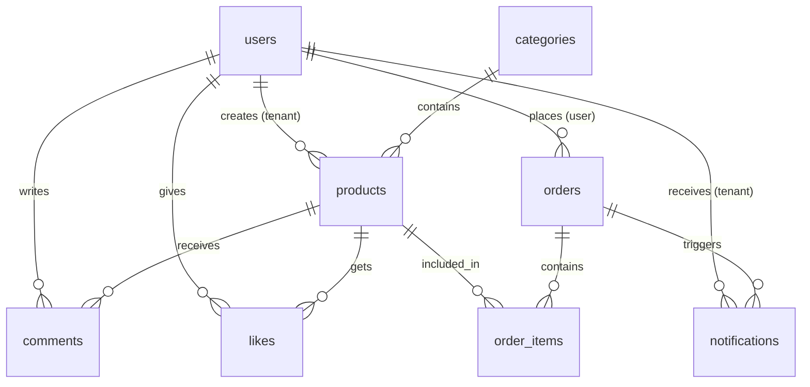

<div align="center">


<br/>

<p>
  
  
  
  
</p>

<p>
  
  
  
  
</p>

<p>
  
  
  
</p>


</div>

## 📌 Overview

**E-Kraft** adalah platform e-commerce full-stack modern berbasis multi-tenant, dirancang untuk ekosistem kampus maupun bisnis skala kecil–menengah. Setiap tenant (penjual) mendapatkan toko dan dashboard analytics tersendiri, sementara admin dapat memantau seluruh sistem dari satu panel terpusat.

<div align="center">

| 🏪 Multi-Tenant | 🔐 3 Role Auth | 📱 Mobile-First | 📊 Analytics | 🔔 Notifikasi |
|:-:|:-:|:-:|:-:|:-:|
| Toko per tenant | Admin / Tenant / User | Responsive UI | Dashboard lengkap | Real-time alerts |

</div>


## ✨ Fitur Lengkap

<details>
<summary><b>🎨 Frontend</b></summary>

<br/>

| Fitur | Detail |
|-------|--------|
| 🏠 **Homepage** | Carousel dinamis, kategori, produk unggulan |
| 🔍 **Search & Filter** | Pencarian produk dengan analytics klik |
| 🛍️ **Product Detail** | Galeri gambar, rating, komentar/review, likes |
| 🛒 **Keranjang Belanja** | Tambah, hapus, update quantity |
| ❤️ **Wishlist** | Simpan produk favorit |
| 📦 **Order Management** | Riwayat order, detail, status tracking |
| 🏪 **Store Pages** | Halaman toko per tenant |
| 🔔 **Notifikasi** | Alert real-time untuk tenant |
| 👤 **Profile** | Edit profil, foto, metode pembayaran |
| 🔐 **Auth Lengkap** | Login, Register, Google OAuth, Forgot Password |
| 📊 **Admin Dashboard** | Kelola user, tenant, produk, laporan |
| 📋 **Tenant Dashboard** | Kelola produk, pesanan, analytics toko |
| 📱 **WhatsApp Integration** | Hubungi penjual langsung via WA |
| 📄 **Export** | Export data ke Excel / PDF (jsPDF + xlsx) |
| 🎨 **Animasi** | Framer Motion transitions |

</details>

<details>
<summary><b>⚙️ Backend</b></summary>

<br/>

| Fitur | Detail |
|-------|--------|
| 🔗 **RESTful API** | 14+ route modules terstruktur |
| 🔐 **JWT Auth** | Token 24 jam, refresh otomatis |
| 🔑 **Google OAuth2** | Login/register via Google |
| 📧 **Email Service** | Reset password via Nodemailer/SMTP |
| 🚦 **Rate Limiting** | Global 1000/15min, Auth 50/15min |
| 🛡️ **Input Validation** | express-validator di semua endpoint |
| 📁 **File Upload** | Multer untuk produk, KTM, carousel, QRIS |
| 🗄️ **MySQL** | Query langsung dengan mysql2 + connection pool |
| 🔄 **Auto Migration** | Tabel dibuat otomatis saat server start |
| 📊 **Analytics** | Sales, produk terlaris, pertumbuhan user |
| 🌐 **CORS** | Whitelist origin via environment variable |
| 📝 **Logger** | Winston-based structured logging |

</details>


## 🛠️ Tech Stack

<div align="center">

### Frontend
| Package | Versi | Fungsi |
|---------|-------|--------|
| React | 19.1.0 | UI Library |
| Vite | 6.3.6 | Build Tool |
| Tailwind CSS | 4.1.11 | Styling |
| Framer Motion | 12.23.9 | Animasi |
| React Router DOM | 7.7.0 | Routing |
| Axios | 1.13.2 | HTTP Client |
| Chart.js + react-chartjs-2 | 4.5.0 | Grafik & Visualisasi |
| React Icons | 5.5.0 | Icon Library |
| Flowbite React | 0.12.3 | UI Components |
| html2canvas + jsPDF | latest | Export PDF |
| xlsx | 0.18.5 | Export Excel |
| @emailjs/browser | 4.4.1 | Contact Form Email |

### Backend
| Package | Versi | Fungsi |
|---------|-------|--------|
| Express | 4.18.2 | Web Framework |
| MySQL2 | 3.6.5 | Database Driver |
| jsonwebtoken | 9.0.2 | JWT Auth |
| bcrypt | 6.0.0 | Password Hashing |
| Multer | 1.4.5-lts | File Upload |
| Nodemailer | 9.0.1 | Email (SMTP) |
| express-rate-limit | 8.5.2 | Rate Limiting |
| express-validator | 7.3.2 | Input Validation |
| jimp | 1.6.1 | Image Processing |
| dotenv | 16.3.1 | Environment Config |
| nodemon | 3.0.2 | Dev Hot-reload |

</div>


## 📁 Struktur Project

```
🛒 Ecommerce/
├── 📦 frontend/                    # React + Vite App
│   └── src/
│       ├── pages/                  # 25+ halaman (Home, Cart, Orders, Dashboard, dll)
│       ├── components/             # Komponen reusable (Modal, ProtectedRoute, dll)
│       ├── context/                # AuthContext, SettingsContext
│       ├── hooks/                  # useLastVisited, useGoogleAuth, useErrorHandler
│       ├── services/               # Axios API service layer
│       ├── utils/                  # errorHandler, imageUtils, iconMapper
│       └── config/                 # api.js (base URL config)
│
├── 🚀 backend/                     # Node.js + Express API
│   └── src/
│       ├── controllers/            # 10 controllers (product, order, analytics, dll)
│       ├── routes/                 # 14 route modules
│       ├── middleware/             # auth.js (JWT verify), validate.js
│       ├── models/                 # Product.js, Category.js
│       ├── migrations/             # Auto-run DB migrations
│       ├── utils/                  # logger.js, mailer.js
│       └── config/                 # database.js (MySQL pool)
│
├── 🗄️ ecommerce.sql                # Full database dump
├── 🗺️ database-diagram.dbml        # Skema DB (dbdiagram.io)
├── 🐳 docker-compose.yml           # Semua service (backend, frontend, mysql, phpmyadmin)
├── 🐳 docker-compose-phpmyadmin.yml
└── 📋 README.md
```


## 🗄️ Skema Database



<details>
<summary><b>📋 Detail Tabel Database</b></summary>

<br/>

| Tabel | Kolom Penting | Keterangan |
|-------|--------------|------------|
| `users` | id, username, email, role, store_name, nim, student_card_image, google_id | Multi-role: admin/tenant/user |
| `products` | id, name, price, stock, stock_status, category_id, created_by, likes_count, whatsapp | Produk milik tenant |
| `categories` | id, name, icon, link | Kategori produk |
| `orders` | order_id, user_id, total, status, rejection_reason | Status: pending/accepted/rejected/completed |
| `order_items` | order_id, product_id, quantity, price, status | Item per order |
| `comments` | product_id, user_id, rating, comment_type | Komentar & review produk |
| `likes` | user_id, product_id | Wishlist/like produk |
| `notifications` | type, tenant_id, order_id, read_status | Alert untuk tenant |
| `carousel_items` | title, image, button_link, active, display_order | Banner homepage |
| `contacts` | name, email, subject, message, status | Form kontak |
| `password_reset_tokens` | user_id, token, expires_at, used | Reset password 1 jam |

</details>


## 🚀 Quick Start

### Prasyarat

```
✅ Docker & Docker Compose   ✅ Git   ✅ Node.js 18+ (untuk setup manual)
```

### 🐳 Dengan Docker (Direkomendasikan)

**1. Clone repository**
```bash
git clone https://github.com/your-username/ecommerce-platform.git
cd ecommerce-platform
```

**2. Salin dan isi environment variables**
```bash
cp .env.example .env
# Edit .env sesuai kebutuhan
```

**3. Jalankan semua service**
```bash
docker compose up -d
```

**4. Import database** *(jika belum otomatis)*
```bash
docker exec -i ecommerce-mysql-1 mysql -u root -p<DB_ROOT_PASSWORD> e-commerce < ecommerce.sql
```

**5. Akses aplikasi**

| Service | URL |
|---------|-----|
| 🎨 Frontend | http://localhost:3000 |
| 🔧 Backend API | http://localhost:5006 |
| 🗄️ phpMyAdmin | http://localhost:8080 |
| 📊 MySQL | localhost:3306 |

---

### ⚙️ Setup Manual (Tanpa Docker)

**Backend**
```bash
cd backend
cp .env.example .env   # isi semua variabel
npm install
npm run dev            # atau: npm start
```

**Frontend**
```bash
cd frontend
cp .env.example .env   # isi VITE_API_BASE_URL & VITE_SERVER_URL
npm install
npm run dev
```


## 🔧 Environment Variables

### Root `.env` (Docker)
```env
# Database
DB_ROOT_PASSWORD=your_secure_db_password
DB_NAME=e-commerce
DB_USER=root

# Backend
PORT=5006
JWT_SECRET=your_jwt_secret_min_32_characters
ALLOWED_ORIGINS=http://localhost:3000,http://localhost:5173
FRONTEND_URL=http://localhost:3000

# Google OAuth2
GOOGLE_CLIENT_ID=your_google_client_id
GOOGLE_CLIENT_SECRET=your_google_client_secret

# SMTP Email
SMTP_HOST=smtp.gmail.com
SMTP_PORT=587
SMTP_USER=your_email@gmail.com
SMTP_PASS=your_smtp_app_password

# Frontend Build
VITE_API_BASE_URL=http://localhost:5006/api
VITE_SERVER_URL=http://localhost:5006
VITE_GOOGLE_CLIENT_ID=your_google_client_id.apps.googleusercontent.com
```

> 💡 **Tips SMTP Gmail**: Aktifkan 2FA → buat App Password di myaccount.google.com → gunakan sebagai `SMTP_PASS`


## 🔐 Autentikasi & Role

<div align="center">

| Role | Akses | Fitur Utama |
|------|-------|-------------|
| 👑 **Admin** | Full sistem | Kelola semua user, tenant, produk, analytics global, carousel |
| 🏪 **Tenant** | Toko sendiri | Kelola produk & stok, terima order, analytics toko, QRIS/KTM |
| 👤 **User** | Fitur konsumen | Browse, wishlist, keranjang, order, komentar & rating |

</div>

### Alur Autentikasi

```
Login/Register ──→ JWT Token (24h) ──→ Protected Routes
     ↕
Google OAuth2 ──→ Code Exchange ──→ JWT Token
     ↕
Forgot Password ──→ Email Token (1h) ──→ Reset Password
```

### Default Credentials (dari database seed)

```
Admin   : admin@ekraft.com   / (cek database seed)
Tenant  : tenant@ekraf.com   / (cek database seed)
User    : user@ekraft.com    / (cek database seed)
```


## 📡 API Reference

Base URL: `http://localhost:5006/api`

<details>
<summary><b>🔐 Auth</b></summary>

| Method | Endpoint | Auth | Keterangan |
|--------|----------|------|------------|
| POST | `/auth/register` | ❌ | Registrasi user/tenant |
| POST | `/auth/login` | ❌ | Login (username/email + password) |
| POST | `/auth/google/code` | ❌ | Google OAuth — tukar code → JWT |
| POST | `/auth/google/complete` | ❌ | Lengkapi profil Google user baru |
| POST | `/auth/forgot-password` | ❌ | Kirim email reset password |
| POST | `/auth/reset-password` | ❌ | Reset password dengan token |

</details>

<details>
<summary><b>🛍️ Products</b></summary>

| Method | Endpoint | Auth | Keterangan |
|--------|----------|------|------------|
| GET | `/products` | ❌ | List semua produk (query: category, search, page) |
| GET | `/products/:id` | ❌ | Detail produk |
| POST | `/products` | ✅ Tenant | Tambah produk baru |
| PUT | `/products/:id` | ✅ Tenant | Update produk |
| DELETE | `/products/:id` | ✅ Tenant | Hapus produk |

</details>

<details>
<summary><b>📦 Orders</b></summary>

| Method | Endpoint | Auth | Keterangan |
|--------|----------|------|------------|
| POST | `/orders` | ✅ User | Buat order baru |
| GET | `/orders` | ✅ | Riwayat order user |
| GET | `/orders/:id` | ✅ | Detail order |
| PUT | `/orders/:id` | ✅ Tenant | Update status (accepted/rejected/completed) |

</details>

<details>
<summary><b>💬 Comments & Likes</b></summary>

| Method | Endpoint | Auth | Keterangan |
|--------|----------|------|------------|
| GET | `/comments?product_id=` | ❌ | Komentar produk |
| POST | `/comments` | ✅ | Tambah komentar/review |
| POST | `/likes` | ✅ | Toggle like/wishlist |
| GET | `/likes?product_id=` | ✅ | Status like produk |

</details>

<details>
<summary><b>🔔 Notifications</b></summary>

| Method | Endpoint | Auth | Keterangan |
|--------|----------|------|------------|
| GET | `/notifications` | ✅ Tenant | Ambil notifikasi |
| PUT | `/notifications/:id/read` | ✅ | Tandai dibaca |
| DELETE | `/notifications/:id` | ✅ | Hapus notifikasi |

</details>

<details>
<summary><b>📊 Analytics</b></summary>

| Method | Endpoint | Auth | Keterangan |
|--------|----------|------|------------|
| GET | `/analytics/dashboard` | ✅ Admin | Statistik global |
| GET | `/analytics/sales` | ✅ Admin | Data penjualan |
| GET | `/tenant-analytics/dashboard` | ✅ Tenant | Statistik toko |
| GET | `/tenant-analytics/products` | ✅ Tenant | Performa produk |

</details>

<details>
<summary><b>Endpoint Lainnya</b></summary>

| Method | Endpoint | Auth | Keterangan |
|--------|----------|------|------------|
| GET/POST/PUT/DELETE | `/categories` | Mixed | Manajemen kategori |
| GET/POST/PUT/DELETE | `/carousel` | ✅ Admin | Manajemen banner |
| GET/POST | `/contacts` | Mixed | Form kontak |
| GET/PUT | `/profile` | ✅ | Profil pengguna |
| GET/PUT/DELETE | `/users` | ✅ Admin | Manajemen user |
| POST | `/upload` | ✅ | Upload gambar |
| GET | `/health` | ❌ | Health check server |

</details>


## 🐳 Docker Services

```yaml
# docker-compose.yml — 4 service:
frontend    → port 3000  (Nginx + React build)
backend     → port 5006  (Node.js + Express)
mysql       → port 3306  (MySQL 8.0 + auto-import ecommerce.sql)
phpmyadmin  → port 8080  (DB management UI)
```

**Perintah Docker berguna:**
```bash
# Jalankan semua service
docker compose up -d

# Lihat log backend
docker compose logs -f backend

# Restart service tertentu
docker compose restart backend

# Stop semua
docker compose down

# Stop + hapus volume (RESET database)
docker compose down -v
```


## 📜 NPM Scripts

### Backend
```bash
npm run dev        # Development dengan nodemon
npm start          # Production
npm run setup-db   # Setup database awal
npm run migrate-db # Jalankan migrasi
```

### Frontend
```bash
npm run dev        # Development server (Vite)
npm run build      # Build production
npm run preview    # Preview build
npm run lint       # ESLint check
```


## 🐛 Known Issues & 🔮 Roadmap

<div align="center">

| 🐛 Known Issues | 🔮 Coming Soon |
|----------------|----------------|
| Rating perlu manual refresh setelah submit | 💬 Real-time chat (WebSocket) |
| Upload gambar belum ada validasi ukuran max | 💳 Payment gateway (Midtrans/Xendit) |
| WhatsApp integration perlu nomor manual per produk | 📱 PWA / Mobile App |
| Real-time notifikasi masih polling, belum SSE/WS | 🤖 AI product recommendation |
| `dev_reset_url` tampil di response ketika SMTP belum dikonfigurasi | 🌍 Multi-language (i18n) |
| — | 🧪 Unit & Integration Tests |
| — | 🔄 CI/CD Pipeline |

</div>


## 🤝 Kontribusi

1. 🍴 Fork repository ini
2. 🌿 Buat branch fitur: `git checkout -b feature/NamaFitur`
3. 💾 Commit: `git commit -m 'feat: tambah NamaFitur'`
4. 📤 Push: `git push origin feature/NamaFitur`
5. 🔄 Buat Pull Request


## 📄 Lisensi

Project ini dilisensikan di bawah **MIT License** — bebas digunakan, dimodifikasi, dan didistribusikan.

---

<div align="center">


<br/>


<br/><br/>

⭐ **Jika project ini bermanfaat, jangan lupa beri bintang!** ⭐


</div>
